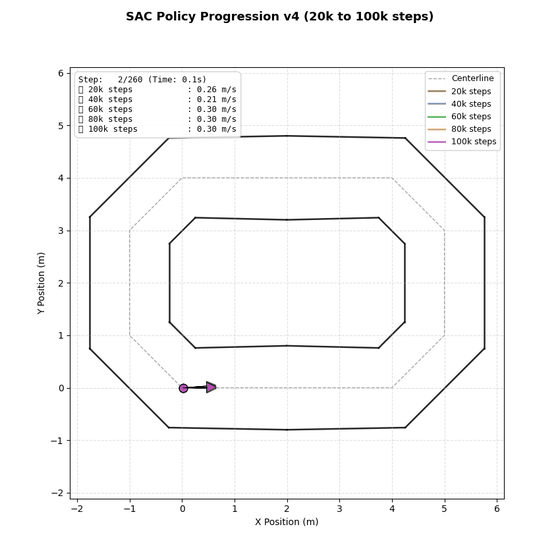
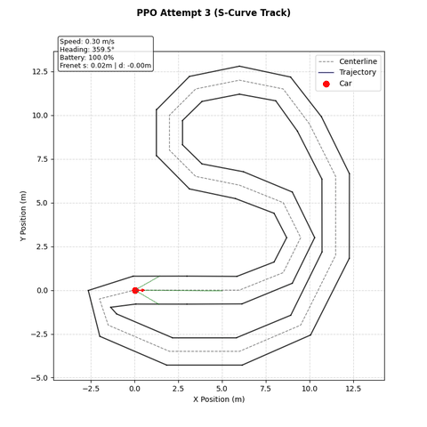
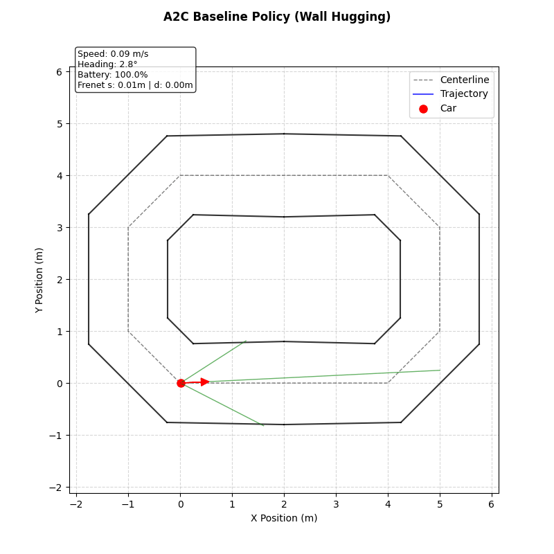
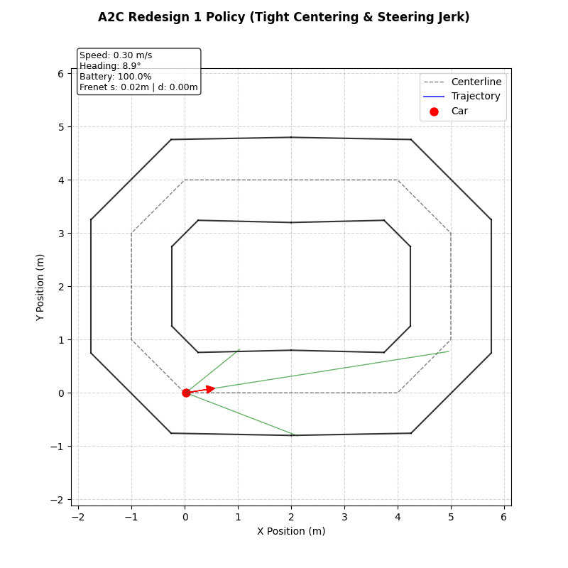
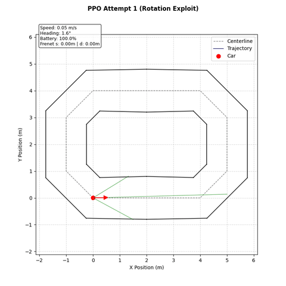
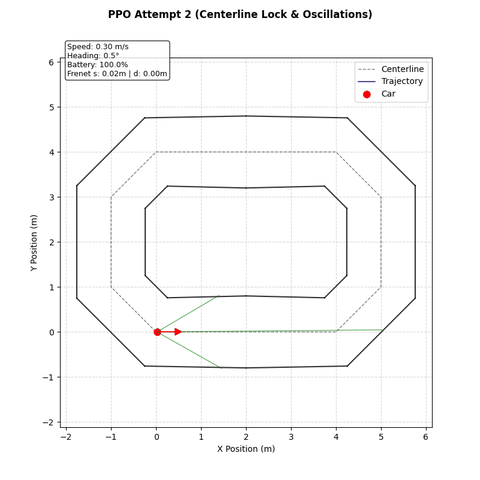
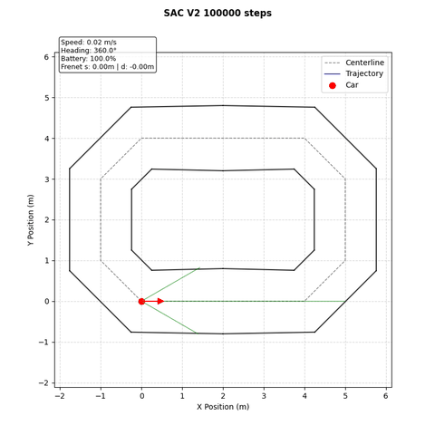
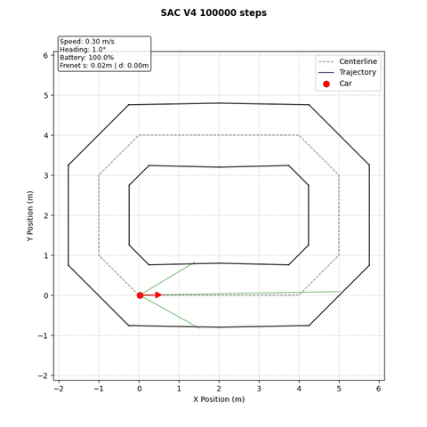

# Autonomous RC-Car Control Platform

[](https://www.python.org/)
[](#)

<p align="center">
  
  <br>
  <em><b>Autonomous Driving Policy Progression:</b> Concurrent multi-agent simulation demonstrating the evolutionary convergence of Soft Actor-Critic (SAC v4) across intermediate checkpoints (20k to 100k steps).</em>
</p>

## Overview

This repository contains a modular, clean, and highly decoupled software platform designed for autonomous driving development. It provides a structured foundation that enables a seamless transition between a 2D Kinematic Simulation environment and a physical, servo-driven 1/8 scale RC car chassis. 

By enforcing strict boundaries between physical dynamics, track layout geometry, sensor perception systems, and control logic, the platform supports rapid prototyping of classical controllers, computer vision pipelines, and Reinforcement Learning policies.

## Policy Generalization Across Track Layouts

Demonstration of our top-performing policy (**PPO Attempt 3**, `PPO_policy_update_reward_1.pth`) evaluated zero-shot across simulation track layouts without retraining:

| `default_oval` Track | `s_curve` Track |
| :---: | :---: |
|  |  |
| **Default Oval:** Smooth, continuous lap navigation with zero control chatter and tight centerline lock ($d \approx 0$). | **S-Curve:** Successfully navigates reverse curves and continuous chicanes with smooth steering adjustments. |

Note that SAC version 4 also generalizes. Try it out by running the following on bash: 
```bash
python -m scripts.autonomous_drive --algo SAC --weights models/sac/version4/SAC_100000.pth --track s_curve
```

## Roadmap

- [x] **Phase 1: Repository Architecture & Contracts Scaffolding**
  * Establish DTOs, interfaces, and directory tree configurations.
- [x] **Phase 2: Simulation Physics & Raycasting**
  * Implement the Kinematic 2D bicycle dynamics model.
  * Implement coordinate centerline boundary check queries.
  * Implement numerical raymarching for simulated Lidar range sweeps.
- [x] **Phase 3: Reinforcement Learning & Continuous Policy Control**
  * Implement Gymnasium environment wrapper (`RCCarEnv`) and Frenet reward calculator (`RewardCalculator`).
  * Implement Advantage Actor-Critic (`A2CAgent`) baseline with online 1-step TD learning.
  * Implement `RolloutBuffer` with Generalized Advantage Estimation (`GAE-λ`) and mini-batch SGD.
  * Implement Proximal Policy Optimization (`PPOAgent`) with clipped surrogate loss and warm-start checkpointing.
  * Implement Soft Actor-Critic (`SACAgent`) off-policy maximum-entropy actor-critic setup with twin Q-networks.
  * Implement automated simulation GIF recorder (`scripts/record_models.py`) and model progression tracking.
- [ ] **Phase 4: Frame Stacking & Multi-Track Curriculum Training (Next)**
  * Implement 4-frame observation stacking to provide temporal velocity/acceleration state.
  * Train policies across randomized track layouts (`default_oval`, `s_curve`, `figure_eight`).
- [ ] **Phase 5: Hardware-in-the-Loop & Physical Deployment**
  * Deploy trained PPO policy onto physical servo-driven scale RC car chassis.

## Features

* **Hardware Abstraction Layer**: Concrete classes for simulated physics backends and physical actuators bind to a common vehicle interface contract, enabling hardware-agnostic control logic.
* **Frenet Frame Transformation**: The track environment computes longitudinal displacement and lateral offsets to translate Cartesian coordinates into track-relative coordinates, simplifying state observations for Reinforcement Learning.
* **Mock-in-the-Loop Simulation**: Includes a pure-Python 2D Kinematic bicycle physics engine and numerical raymarching Lidar simulator for rapid offline unit testing and verification.
* **Decoupled Observability**: Observability tools like telemetry logging (CSV) and matplotlib dashboards run as subscriber observers to the main control loops, preventing telemetry logging code from interfering with active steering.

## Policy Progression

This section tracks the evolutionary progression of our Reinforcement Learning policies, showcasing empirical driving behaviors across reward function iterations.

| Model Checkpoint | Demonstration | Behavior & Characteristics |
| :--- | :--- | :--- |
| **`a2c_policy.pth`**<br>*(A2C Baseline)* |  | **Wall-Hugging Behavior:** Navigates track without hard collisions but settles into a sub-optimal equilibrium hugging outer track boundaries rather than maintaining lane center ($d \approx 0$). |
| **`a2c_policy_redesign_1.pth`**<br>*(A2C Redesign 1)* |  | **Tight Lane Centering & Steering Jerk:** Introduced Gaussian centering ($\exp(-(d/\sigma)^2)$). Achieves tight centerline tracking ($d \approx 0$), but exhibits high-frequency steering chatter due to un-penalized action rates in A2C. |
| **`PPO_policy_exploites...pth`**<br>*(PPO Attempt 1)* |  | **Rotation Exploit:** Contained an additive `+ 0.5 * centering_factor` reward term independent of speed. Discovered a reward-farming exploit spinning continuously in place near $d \approx 0$ to collect positive returns without driving forward. |
| **`PPO_policy_update_reward.pth`**<br>*(PPO Attempt 2)* |  | **Centerline Lock & Smoothness Gain:** Removed the additive `+ 0.5 * centering_factor` term, forcing `centering_factor` to act strictly multiplicatively with forward velocity progress. Completely eliminated rotation exploits with major smoothness gains over A2C. |
| **`PPO_policy_update_reward_1.pth`**<br>*(PPO Attempt 3)* |  | **Warm-Started Lap Completion:** Built directly on top of Attempt 2 by initializing from its partially trained weights and continuing optimization. Delivers smooth, highly polished lap navigation. |
| **`models/sac/version2/SAC_100000.pth`**<br>*(SAC Version 2)* |  | **Anti-Collision / Reversing Policy:** Enabled critic gradient flow to actor. Avoids collisions by halting or reversing near walls, but struggles with forward navigation due to target network lag ($p=0.95$ every 500 steps) and unconstrained `log_std`. |
| **`models/sac/version3/SAC_100000.pth`**<br>*(SAC Version 3)* |  | **Crawling & Tensor Distortion:** Fixed step update frequency and variance heads, but a global batch reduction bug in the log-prob Jacobian distorted Bellman targets, causing slow crawling behavior. |
| **`models/sac/version4/SAC_100000.pth`**<br>*(SAC Version 4)* |  | **High-Speed Off-Policy Optimization:** Fully corrected multivariate log-prob reduction, clamped `log_std \in [-20, 2]`, and continuous Polyak soft updates ($\tau=0.005$ every step). Navigates at high speeds ($\approx 5.0\text{ m/s}$) with tight centerline tracking ($d \approx 0$) and stable twin critics. |

For detailed analysis, reward engineering observations, and training stability dynamics, see [models/README.md](models/README.md).

## Repository Structure

The codebase is organized as follows (*note: scaffolded modules contain interface signatures and contracts that will be implemented gradually as physical deployment progresses*):

```text
RC-car/
├── docs/                       # Architectural diagrams and demonstration media
│   ├── architecture.md         # Dataflow architecture and telemetry specifications
│   └── media/                  # Animated policy simulation GIFs
├── models/                     # Trained RL policy checkpoints (.pth) and progression log
│   ├── a2c/                    # A2C baseline and redesign weight checkpoints
│   ├── ppo/                    # PPO attempt weight checkpoints
│   ├── sac/                    # SAC versioned weight checkpoints (v1-v4)
│   └── README.md               # Empirical model progression log and comparison matrix
├── scripts/                    # User-facing CLI entry points
│   ├── autonomous_drive.py     # Main autonomous policy and vision navigation runner
│   ├── drive_visualize.py      # Real-time Matplotlib visualizer dashboard
│   ├── keyboard_drive.py       # Terminal keyboard teleoperation cockpit
│   ├── record_models.py        # Automated policy simulation GIF recording pipeline
│   ├── simulate_car.py         # Scripted physics simulation runner with CSV logging
│   └── train_rl.py             # RL policy training entry point (A2C, PPO, SAC)
│
├── src/                        # Core library source code
│   ├── common/                 # Contracts, DTOs, and abstract base classes
│   │   ├── backend.py          # Abstract CarBackend interface contract
│   │   ├── sensor.py           # Abstract LidarDevice sensor contract
│   │   └── types.py            # Common data structures (CarTelemetry, CarCommand, FrenetState)
│   │
│   ├── drive/                  # Guidance, Navigation, and Control (GNC)
│   │   ├── collision_avoid.py  # Emergency proximity braking safety controller
│   │   ├── controller.py       # High-level trajectory planning controller
│   │   ├── rl_controller.py    # RL policy inference vehicle controller
│   │   └── sim_backend.py      # 2D Kinematic bicycle dynamics simulator
│   │
│   ├── environment/            # Map configurations and boundary definitions
│   │   ├── obstacles.py        # Database of static/dynamic obstacle objects
│   │   └── track.py            # Track geometry waypoints, Frenet projection, and walls
│   │
│   ├── perception/             # Sensor processing and computer vision
│   │   ├── lane_detector.py    # OpenCV lane detection offset estimators
│   │   ├── lidar_driver.py     # Serial driver interface for physical laser scanners
│   │   ├── lidar_scan.py       # Lidar sweep point cloud filters and clustering
│   │   └── lidar_sim.py        # Raymarching simulator calculating virtual ranges
│   │
│   ├── rl/                     # Reinforcement Learning framework
│   │   ├── agents/             # RL agent policy implementations
│   │   │   ├── a2c_agent.py    # Advantage Actor-Critic (A2C) agent
│   │   │   ├── ppo_agent.py    # Proximal Policy Optimization (PPO) agent
│   │   │   ├── sac_agent.py    # Soft Actor-Critic (SAC) agent
│   │   │   └── random_agent.py # Random baseline agent
│   │   ├── networks/           # PyTorch neural network policy architectures
│   │   │   ├── actor.py        # Gaussian actor policy network (PPO/A2C)
│   │   │   ├── critic.py       # Value function critic network (PPO/A2C)
│   │   │   ├── sac_actor.py    # Squashed Gaussian actor network (SAC)
│   │   │   ├── sac_critic.py   # State-action value twin Q-network (SAC)
│   │   │   └── networks.py     # Shared MLP backbone architectures
│   │   ├── base_agent.py       # Abstract BaseAgent policy contract
│   │   ├── env.py              # Gymnasium environment wrapping car physics and sensors
│   │   ├── replay_buffer.py    # Off-policy experience replay buffer
│   │   ├── rewards.py          # Frenet reward shaping calculator
│   │   └── rollout_buffer.py   # Fixed-capacity GAE rollout trajectory buffer
│   │
│   ├── state/                  # Aggregators and health estimators
│   │   └── car_state.py        # Statistics tracker (odometry, battery check)
│   │
│   └── tools/                  # Observability and teleoperation tools
│       ├── keyboard_teleop.py  # Keystroke-to-actuator command mapper
│       ├── telemetry_logger.py # CSV telemetry writer subscriber observer
│       └── visualizer.py       # Real-time Matplotlib track visualizer
│
└── tests/                      # Unit test suite
    ├── test_mvp_car.py         # Kinematics and safety unit tests
    ├── test_perception.py      # Perception and lane parsing unit tests
    ├── test_sim_backend.py     # Physics engine dynamics unit tests
    └── test_track.py           # Track boundary and Frenet projection unit tests
```

## Setup and Getting Started

### 1. Initialize Virtual Environment
Set up a local Python virtual environment and install project dependencies:
```bash
# Create the virtual environment
python3 -m venv .venv

# Activate the virtual environment
source .venv/bin/activate

# Install required packages
pip install -r requirements.txt
```

### 2. Verify Scaffolding Installation
Run the unit test suite to verify that packages import correctly and no syntax errors are present:
```bash
python3 -m pytest tests/
```

### 3. Run Autonomous Driving Inference (`autonomous_drive.py`)
Run autonomous policy inference with real-time Matplotlib visualization using [scripts/autonomous_drive.py](scripts/autonomous_drive.py):

```bash
# Run PPO Attempt 3 (top-performing model) on default_oval track
python scripts/autonomous_drive.py --algo PPO --weights models/PPO_policy_update_reward_1.pth --track default_oval

# Run PPO Attempt 3 zero-shot on s_curve track
python scripts/autonomous_drive.py --algo PPO --weights models/PPO_policy_update_reward_1.pth --track s_curve
```

#### Command-Line Arguments:
* `--algo`: Policy algorithm (`PPO`, `A2C`, `SAC`, or `RANDOM`). Default: `A2C`.
* `--weights`: Path to trained PyTorch weights checkpoint file (`.pth`).
* `--track`: Target track layout (`default_oval`, `s_curve`, `figure_eight`). Default: `default_oval`.
* `--steps`: Maximum simulation steps to execute (default: `1000`).

## License

TBD
