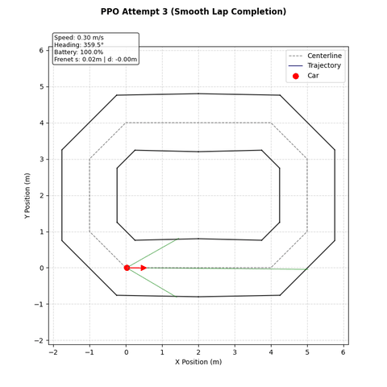

# Model Checkpoints and Policy Progression Log

This directory contains trained Reinforcement Learning (RL) policy model weights (`.pth` PyTorch checkpoints). This document records the progression of policy iterations, detailing reward function adjustments, empirical driving behaviors, training stability observations, and targeted improvements across algorithms.

---

## 1. A2C Model Progression and Empirical Observations

### 1.1 `a2c_policy.pth` — A2C Baseline Iteration (First Attempt)

* **Algorithm:** Advantage Actor-Critic (A2C, 1-Step TD)
* **Reward Formulation:** Naive baseline speed incentive combined with linear lateral displacement penalties.
* **Observed Driving Behavior:**
  * **Success:** Successfully completes laps without collisions into track boundaries.
  * **Defect:** Exhibits severe **wall-hugging behavior**. The policy settles into a sub-optimal equilibrium where it rides close to outer track boundaries rather than maintaining lane center ($d \approx 0$).

---

### 1.2 `a2c_policy_redesign_1.pth` — A2C Reward Redesign (Iteration 1)

* **Algorithm:** Advantage Actor-Critic (A2C, 1-Step TD)
* **Reward Formulation Changes:**
  * **Removal of Arc-Length Progression:** Eliminated linear centerline delta reward ($\Delta s / \Delta t$) to prevent reward exploitation, such as policies oscillating back and forth to maximize reward accumulation.
  * **Gaussian Centering Incentive:** Replaced linear lateral penalty with a steep Gaussian decay term centered at $d=0$:
    $$\text{centering\_factor} = \exp\left(-\left(\frac{d}{\sigma}\right)^2\right)$$
* **Observed Driving Behavior:**
  * **Success:** Excellent lateral centering. The vehicle remains positioned near the track centerline ($d \approx 0$) through straightaways and curves.
  * **Defect:** High control chatter and **steering jerk**. Because an action rate / differential steering penalty ($\|a_t - a_{t-1}\|^2$) was not yet incorporated in A2C, the policy outputs rapid high-frequency steering oscillations.
* **Training Dynamics and Inconsistency:**
  * **High Variance:** Training stability is inconsistent. Repeated training runs under identical hyperparameter settings frequently suffer from performance degradation or policy collapse due to 1-step TD gradient variance.

---

## 2. PPO Model Progression and Empirical Observations

### PPO Baseline Framework & Reward Formulation
When transitioning to Proximal Policy Optimization (PPO, GAE-$\lambda$), several core reward enhancements were established right from the baseline:

* **Removal of Arc-Length Progression:** Eliminated linear centerline delta reward ($\Delta s / \Delta t$) to prevent reward-farming exploits where policies oscillate back and forth to maximize progress terms.
* **Heading Alignment Coupling:** Maintained directionally aligned progress reward $\left( \frac{v}{v_{\text{target}}} \cdot \cos(\theta_{\text{err}}) \right)$.
* **Gaussian Centering Incentive:** Replaced linear lateral displacement penalties with a steep Gaussian decay term centered at $d=0$:
  $$\text{centering\_factor} = \exp\left(-\left(\frac{d}{\sigma}\right)^2\right)$$
* **Differential Action Rate / Steering Jerk Penalty:** Incorporated an action smoothing penalty from the outset of PPO development:
  $$\mathcal{P}_{\text{jerk}} = \gamma_{\text{jerk}} \cdot (a_{\text{steering}, t} - a_{\text{steering}, t-1})^2$$

---

### 2.1 `PPO_policy_exploites_small_d_by_rotating.pth` — PPO Attempt 1 (Rotation Exploit)

* **Algorithm:** Proximal Policy Optimization (PPO, GAE-$\lambda$)
* **Reward Formulation Defect:** Included a standalone additive centering term:
  $$\text{total\_reward} = (0.5 \cdot \text{progress\_reward} \cdot \text{centering\_factor}) + (0.5 \cdot \text{centering\_factor}) - \mathcal{P}_{\text{jerk}}$$
* **Observed Driving Behavior:**
  * **Reward Exploit:** The policy discovered a reward-farming exploit where it spins continuously in place near $d \approx 0$. Because the additive `+ 0.5 * centering_factor` term awarded positive continuous returns just for remaining near the centerline without forward velocity, the agent maximized cumulative returns by pivoting in tight circles.

---

### 2.2 `PPO_policy_update_reward.pth` — PPO Attempt 2 (Centerline Lock & Multiplicative Centering)

* **Algorithm:** Proximal Policy Optimization (PPO, GAE-$\lambda$)
* **Reward Formulation Changes:**
  * **Removed Additive Centering Factor:** Removed the standalone `+ 0.5 * centering_factor` term, forcing `centering_factor` to act strictly as a multiplicative scalar on velocity progress:
    $$\text{total\_reward} = (\text{progress\_reward} \cdot \text{centering\_factor}) - \mathcal{P}_{\text{jerk}}$$
* **Observed Driving Behavior:**
  * **Eliminated Rotation Exploit:** Forcing the centering term to scale velocity progress multiplicatively required the vehicle to drive forward to receive positive rewards, completely eliminating the spinning exploit.
  * **Major Improvement in Smoothness:** Achieved significant gains in trajectory smoothness and stability compared to earlier reward functions trained without jerk penalties (e.g. A2C).

---

### 2.3 `PPO_policy_update_reward_1.pth` — PPO Attempt 3 (Warm-Started Checkpoint & Smooth Lap Completion)

* **Algorithm:** Proximal Policy Optimization (PPO, GAE-$\lambda$)
* **Training Methodology:**
  * **Warm-Start Checkpoint Training:** Initialized from `PPO_policy_update_reward.pth` (Attempt 2) rather than random weight initialization, allowing the policy to retain learned spatial representations while extending optimization.
* **Observed Driving Behavior:**
  * **Polished Lap Navigation:** Delivers exceptionally smooth, continuous lap navigation with optimal speed control, tight centerline tracking ($d \approx 0$), and zero control chatter.

---

## 3. Summary Comparison Matrix

| Model Checkpoint | Demonstration | Algorithm | Primary Feature | Centering ($d \approx 0$) | Control Smoothness | Training Consistency |
| :--- | :--- | :--- | :--- | :--- | :--- | :--- |
| **`a2c_policy.pth`** |  | A2C (1-Step) | Linear speed & boundary penalty | Wall Hugging | Low Oscillations | Inconsistent |
| **`a2c_policy_redesign_1.pth`** |  | A2C (1-Step) | Gaussian centering & progress coupling | Excellent ($d \approx 0$) | Severe Steering Jerk | Inconsistent / High Variance |
| **`PPO_policy_exploites...pth`** |  | PPO (GAE) | Additive centering reward (`+ 0.5 * centering`) | Rotation Exploit | N/A (Spins in place) | High (Converges on exploit) |
| **`PPO_policy_update_reward.pth`** |  | PPO (GAE) | Multiplicative centering (removed additive term) | Excellent ($d \approx 0$) | Significant Smoothness Gain | High |
| **`PPO_policy_update_reward_1.pth`** |  | PPO (GAE) | Warm-started from Attempt 2 | Excellent ($d \approx 0$) | Highly Polished / Smooth | High / Repeatable |

---

## 4. Multi-Track Zero-Shot Generalization (PPO Attempt 3)

To evaluate whether policy representations learned on `default_oval` transfer to unseen track geometries without additional training, `PPO_policy_update_reward_1.pth` (Attempt 3) was evaluated zero-shot on the `s_curve` track layout.

| Track Layout | Simulation Demonstration | Zero-Shot Transfer Analysis |
| :--- | :--- | :--- |
| **`default_oval`** |  | **Primary Training Track:** Achieves continuous lap completion with tight centerline tracking ($d \approx 0$) and optimal speed control. |
| **`s_curve`** |  | **Zero-Shot Transfer (Chicane):** Successfully navigates reverse curves and continuous chicanes, maintaining smooth steering adjustments without off-track collisions. |

---

## 5. Targeted Technical Improvements

1. **Frame Stacking / Temporal Memory:**
   * Concatenate past observation frames ($K=4$) to form a 24D state representation, allowing policies to infer lateral velocity $\dot{d}$ and yaw acceleration.
2. **Multi-Track Curriculum Training:**
   * Train policies across randomized track layouts (`default_oval`, `s_curve`, `figure_eight`) to build generalizable trajectory tracking capability.

